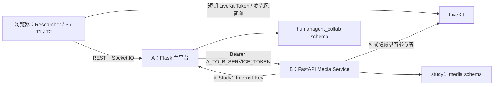

# Study 1 人类与代理协作实验平台

本仓库基于 **A Configurable Research Platform for Human-LLM Agent Collaboration** 扩展了 Study 1 实验系统。当前实现将实验流程与会议媒体能力严格拆分为两个服务：

- **A（主平台）**：唯一的实验流程控制者，负责 Session、角色权限、阶段状态机、Hidden Profile、提交、Review、研究者控制台、主数据库和最终导出；
- **B（会议与 Proxy 服务）**：负责 LiveKit 语音会议、麦克风、录音、ASR、LLM、TTS、单一 Proxy Runtime（X）、逐字稿和中性摘要。

本文档以当前 Study 1 实现为准，面向需要部署、操作实验、联调接口和验证数据的研究者及开发者。

## 项目简介

Study 1 研究的是委托代理参与讨论并完成显式交接的协作过程。系统包含四类身份：

| 身份 | 系统角色 | 主要职责 |
| --- | --- | --- |
| P | `principal` | 配置并授权 X、进入隔离等待室、报告委托预期、阅读摘要/逐字稿、完成理解测量并参与交接后的讨论 |
| T1 | `teammate_1` | 阅读自己的私有材料、参加 X 代理会议、提交暂定决定并参加交接后的同步讨论 |
| T2 | `teammate_2` | 与 T1 相同，但拥有独立的私有材料和提交记录 |
| Researcher | `researcher` | 创建 Session、分配材料、推进阶段、控制会议、监控设备/ASR/Proxy、记录事故并导出数据 |

X 不是独立被试者，不参与个人投票。它只能使用 P 已授权的材料和立场，不能读取未共享的 T1/T2 私有材料，也不能决定实验阶段。

## 当前实现范围

| 模块 | 已实现能力 |
| --- | --- |
| Study 1 前端 | 一次性邀请、角色化 Participant 页面、P 隔离等待室、设备检查、语音会议、Review、研究者控制台、全英文实验 UI |
| A / Flask | 服务器权威状态机、角色权限、材料隔离、锁定与修订式提交、Review 门控、UI 事件、事故、媒体代理接口、完整 ZIP 导出 |
| B / FastAPI | LiveKit Token、Proxy/Sync 房间、隐藏同步会议录音参与者、录音、ASR、LLM、TTS、单一 X、逐字稿、中性摘要、持久化命令与回调 |
| 数据 | A/B PostgreSQL schema 隔离、阶段和操作审计、媒体清单、逐字稿、摘要、录音与版本信息 |
| 实时通信 | Socket.IO 阶段/就绪状态通知；LiveKit 麦克风音频 |

Study 1 已关闭或不使用旧平台的多 Agent floor bidding、文本私聊、交易面板、Proxy 自动投票和 Session 自动开始。实时字幕当前不是 Study 1 的默认功能。

## 实验流程

```text
Researcher 创建 Session，并生成 P/T1/T2 三条一次性邀请
  -> 设备检查、知情同意、身份与角色确认
  -> 三人分别阅读 Hidden Profile 私有材料
  -> 三人提交讨论前个人判断与信心
  -> P 配置 X、选择授权材料并确认授权；T1/T2 等待
  -> P 进入隔离等待室，不能观看或收听代理会议
  -> X + T1 + T2 进行实时语音讨论
  -> T1/T2 提交暂定决定及对决定状态的理解
  -> B 生成中性会议摘要和带时间戳逐字稿
  -> P 先提交委托预期，再解锁 Review
  -> P 阅读摘要；逐字稿默认折叠；系统记录阅读与可见性事件
  -> P 完成理解测量
  -> Researcher 发起显式 Handoff，X 停止参与
  -> P + T1 + T2 进行同步语音讨论
  -> 三人提交最终决定、后续协作任务和个人问卷
  -> Researcher 导出完整实验数据
```

系统不会自动开始 Session，也不会因为 B 发出媒体事件而自动推进阶段。每次阶段推进都由 Researcher 显式操作。

## 系统架构与职责边界



必须保持以下边界：

1. A 是 Session、角色、权限、阶段和主数据的唯一所有者。
2. B 不直接修改 A 的数据库，也不能推进 A 的实验阶段。
3. 浏览器只调用 A；B 的 8000 端口不对公网开放。
4. A 使用 `A_TO_B_SERVICE_TOKEN` 调用 B；B 使用 `X-Study1-Internal-Key` 回调 A。
5. P 不会获得 Proxy Room Token，在 Handoff 前保持媒体隔离。
6. Proxy Room 只允许 T1、T2 和 X；Sync Room 只允许 P、T1 和 T2，X 不会进入同步会议。
7. A 只把 P 锁定的 `proxy_config` 和 P 明确授权的材料发送给 B。
8. B 的 PostgreSQL 用户只能访问 `study1_media`，不能访问 A 的 `humanagent_collab` schema。

字段级 A/B 约束见 [`contracts/study1-media-contract.md`](./contracts/study1-media-contract.md)。

## 快速开始

### 环境要求

- Windows 10/11、macOS 或 Linux；
- Docker Desktop 或 Docker Engine，包含 Docker Compose v2；
- 8 GB 以上可用内存；
- 浏览器允许访问麦克风；
- 首次构建时能够访问 Docker Hub、Debian/Alpine 软件源及 Python/Node 包源。

所有命令都必须在仓库根目录执行。Windows 示例：

```powershell
Set-Location 'C:\path\to\agent-simulation'
Copy-Item .env.example .env
notepad .env
```

macOS/Linux 可使用：

```bash
cp .env.example .env
```

### 配置 `.env`

本地完整栈至少需要配置以下值：

```dotenv
FLASK_SECRET_KEY=replace-with-a-long-random-secret
STUDY1_RESEARCHER_KEY=replace-with-your-researcher-key
STUDY1_INTERNAL_API_KEY=replace-with-a-different-random-secret-at-least-32-characters
A_TO_B_SERVICE_TOKEN=replace-with-another-random-secret-at-least-32-characters
MEDIA_DATABASE_PASSWORD=replace-with-media-database-password
LIVEKIT_API_KEY=replace-with-livekit-key
LIVEKIT_API_SECRET=replace-with-livekit-secret-at-least-32-characters
MEDIA_PROVIDER=mock
```

| 变量 | 是否必填 | 说明 |
| --- | --- | --- |
| `FLASK_SECRET_KEY` | 是 | Flask 和默认 Study 1 Token 签名密钥 |
| `STUDY1_RESEARCHER_KEY` | 是 | Researcher 控制台登录密钥 |
| `STUDY1_TOKEN_SECRET` | 否 | 独立的 Study 1 Token 密钥；未设置时使用 `FLASK_SECRET_KEY` |
| `STUDY1_INTERNAL_API_KEY` | 是 | B 回调 A 的共享密钥；至少 32 字符且不能是占位值 |
| `A_TO_B_SERVICE_TOKEN` | 是 | A 调用 B 的 Bearer Token；至少 32 字符，必须与上一项不同 |
| `MEDIA_DATABASE_PASSWORD` | 是 | B 专用 PostgreSQL 用户密码 |
| `LIVEKIT_API_KEY` | 是 | LiveKit API Key，不能使用 `devkey` 等占位值 |
| `LIVEKIT_API_SECRET` | 是 | LiveKit API Secret；至少 32 字符且不能是占位值 |
| `MEDIA_PROVIDER` | 是 | `mock`、`openai` 或 `azure`；本地首次测试推荐 `mock` |
| `POSTGRES_PORT` | 否 | PostgreSQL 宿主机端口，默认 `5432` |
| `BACKEND_PORT` | 否 | A 的宿主机端口，默认 `5000` |
| `FRONTEND_PORT` | 否 | 前端宿主机端口，默认 `8080` |

不要把真实 `.env`、Token 或模型密钥提交到 Git。

Compose 会在启动前检查 `STUDY1_INTERNAL_API_KEY`、`A_TO_B_SERVICE_TOKEN`、`MEDIA_DATABASE_PASSWORD`、`LIVEKIT_API_KEY` 和 `LIVEKIT_API_SECRET` 是否已提供；Media Service 还会拒绝长度不足或明显为占位值的服务密钥。缺少或无效配置时服务会直接停止，而不会以不安全的默认值运行。

如果本机 `5432` 已被占用，只修改宿主机映射即可：

```dotenv
POSTGRES_PORT=5433
```

容器之间仍通过 `postgres:5432` 通信。

### 启动与检查

```powershell
docker compose config --quiet
docker compose up --build -d
docker compose ps
```

查看启动日志：

```powershell
docker compose logs --tail=100 postgres livekit media-service backend frontend
```

健康状态应满足：

- `postgres`、`livekit`、`media-service` 为 healthy；
- `backend` 和 `frontend` 为 running；
- `humanagent-frontend` 暴露 `8080`；
- `humanagent-backend` 暴露 `5000`。

停止服务：

```powershell
docker compose down
```

该命令不会删除数据库卷。只有在本地数据可丢弃且明确需要重新初始化时，才考虑删除指定卷。

### 页面入口

| 页面/服务 | 默认地址 | 说明 |
| --- | --- | --- |
| Study 1 Researcher | [http://localhost:8080/researcher/study1](http://localhost:8080/researcher/study1) | 创建和控制实验 |
| 一次性邀请 | `http://localhost:8080/study1/join/{token}` | 每位参与者独立链接，只能兑换一次 |
| Study 1 Participant | [http://localhost:8080/study1/participant](http://localhost:8080/study1/participant) | 兑换邀请后自动进入 |
| A / Backend | [http://localhost:5000](http://localhost:5000) | Flask REST 和 Socket.IO |
| LiveKit | `ws://localhost:7880` | 本地 RTC；生产环境必须使用浏览器可达的 `wss://` |

`http://127.0.0.1:5173` 是从源码运行的 Vite 开发服务器；Docker 构建后的正式本地入口是 `http://localhost:8080`。两者不要混用本地登录状态。

## 完整使用教程

### Researcher

1. 打开 `/researcher/study1`，输入 `.env` 中的 `STUDY1_RESEARCHER_KEY`。
2. 填写 Session 名称和最短 Review 阅读时间。
3. 为 P、T1、T2 分别填写或上传私有材料。文件支持 PDF、UTF-8 TXT 和 Markdown；每个文件不超过 20 MiB。
4. 创建 Session，立即保存三条一次性邀请。A 的数据库只保存邀请 Token 的 SHA-256 Hash，原始链接不会再次显示。
5. 分别把链接交给对应参与者，不要交换角色链接。
6. 等待三人完成设备和身份确认后，点击 Start。Session 创建后不会自动开始。
7. 控制台根据 `ready_to_advance` 和 `missing_prerequisites` 显示是否允许进入下一阶段。
8. 在 `PROXY_MEETING` 发出 `START_PROXY_MEETING`；讨论结束时显式发出 `END_CURRENT_MEETING`。
9. 查看 B 的连接、ASR、Proxy、录音和 Artifact 状态；异常时记录 Incident。
10. 摘要仅可在固定 Transcript Checksum 和源 Summary Version 下重试，并必须填写原因。
11. P 完成理解测量后进入 `HANDOFF`，发出 `BEGIN_HANDOFF`。只有 X 已停止且 P/T1/T2 设备预检均成功，B 才返回 `HANDOFF_COMPLETE`。
12. 进入 `SYNC_MEETING` 后发出 `START_SYNC_MEETING`；会议结束时再次显式结束当前会议。
13. 全部问卷完成并进入 `COMPLETED` 后下载最终 ZIP。

Researcher 可执行的 Session 控制：

| Action | 用途 |
| --- | --- |
| `start` | 仅在 `SETUP` 且状态为 waiting 时开始，并进入材料阅读 |
| `pause` | 暂停 running Session |
| `resume` | 恢复 paused Session |
| `extend` | 增加 1 到 86400 秒 |
| `terminate` | 终止未完成 Session，并记录可选原因 |

强制推进阶段时必须填写非空原因。系统会同时记录 Override 和 Phase Transition 审计事件，不覆盖原记录。

### P

1. 打开专属邀请链接并完成一次性兑换；身份由服务器签名 Token 决定。
2. 在 `MATERIAL_READING` 只阅读 P 的 Hidden Profile，完成材料确认。
3. 在 `PRE_VOTE` 提交讨论前判断、理由和信心。
4. 在 `PROXY_CONFIGURATION` 填写优先事项和边界，选择允许 X 使用的 P 材料，并显式确认授权。
5. X 会议期间进入隔离等待室。P 不会获得该房间的 LiveKit Token，也不能听到 T1/T2/X 的讨论。
6. T1/T2 提交暂定决定后，P 在 `DELEGATION_EXPECTATION` 先报告委托预期。
7. 进入 `REVIEW` 后阅读中性摘要；逐字稿默认折叠。系统记录页面进入/离开、摘要可见、逐字稿展开、片段可见、滚动深度和主动阅读时间。
8. 达到最短阅读时间并完成理解测量后等待 Researcher 发起 Handoff。
9. 在 `SYNC_MEETING` 与 T1/T2 直接讨论，随后完成最终决定、后续任务和问卷。

### T1/T2

1. 使用各自的一次性链接登录，完成麦克风检查。
2. 只阅读自己角色的 Hidden Profile，提交材料确认和讨论前判断。
3. 在 P 配置 X 时等待，不会看到 P 的私有配置或其他角色的材料。
4. 在 `PROXY_MEETING` 加入音频，与 X 和另一位 Teammate 讨论。
5. 会议结束后提交暂定决定以及对当前决定状态的理解。
6. Handoff 完成后加入 `SYNC_MEETING`，与 P 和另一位 Teammate 直接讨论。
7. 完成最终决定、后续任务和个人问卷。

### Mock 模式

两个“Mock”概念需要区分：

- `MEDIA_PROVIDER=mock`：仍使用真实 LiveKit 房间、麦克风和录音，但 ASR/LLM/TTS 使用确定性 Mock Provider，适合本地集成测试；
- `MEDIA_GATEWAY_MODE=mock`：A 不连接真实 B，只记录固定命令边界，并由 Researcher Mock Completion 接口模拟媒体结束事件，主要用于 A 的自动化测试。

默认 `docker-compose.yml` 使用 HTTP Media Gateway 连接真实 B，并可配合 `MEDIA_PROVIDER=mock` 测试完整媒体边界。

## 阶段状态机

阶段只能按顺序推进。普通推进必须满足服务器计算的前置条件：

| 顺序 | 阶段 | 进入下一阶段前的关键条件 |
| ---: | --- | --- |
| 1 | `SETUP` | Researcher 显式 Start；系统进入 `MATERIAL_READING` |
| 2 | `MATERIAL_READING` | P/T1/T2 全部提交 `material_ack` |
| 3 | `PRE_VOTE` | P/T1/T2 全部提交 `pre_vote` |
| 4 | `PROXY_CONFIGURATION` | P 提交 `proxy_config`；T1/T2 提交 `proxy_ready` |
| 5 | `PROXY_MEETING` | B 报告代理会议已经结束 |
| 6 | `TENTATIVE_DECISION` | T1/T2 全部提交 `tentative_decision` |
| 7 | `DELEGATION_EXPECTATION` | P 提交 `delegation_expectation`，且中性摘要 Artifact 已就绪 |
| 8 | `REVIEW` | P 已打开 Review 并产生阅读记录；如配置最短时间，还必须达到该时间 |
| 9 | `COMPREHENSION_MEASUREMENT` | P 提交 `comprehension_measurement` |
| 10 | `HANDOFF` | B 报告 `HANDOFF_COMPLETE` |
| 11 | `SYNC_MEETING` | B 报告同步会议已经结束 |
| 12 | `FINAL_DECISION` | P/T1/T2 全部提交 `final_decision` |
| 13 | `FOLLOWUP_TASK` | P/T1/T2 全部提交 `followup_task` |
| 14 | `POST_SURVEY` | P/T1/T2 全部提交 `post_survey` |
| 15 | `COMPLETED` | 终态，可执行最终导出 |

B 的 `MEDIA_READY`、`MEDIA_ERROR`、`MEETING_ENDED` 和 `HANDOFF_COMPLETE` 只更新媒体状态或满足前置条件，不会直接改变阶段。

## 配置说明

### 安全和数据库

A 和 B 使用同一个 PostgreSQL 实例时仍保持权限隔离：

| 数据所有者 | 默认 schema | Docker 用户 |
| --- | --- | --- |
| A | `humanagent_collab` | `POSTGRES_USER` |
| B | `study1_media` | `study1_media` |

首次创建 PostgreSQL Volume 时，`backend/database/docker-init-media.sh` 会初始化 B 的用户和 schema。旧 Volume 不会重新执行初始化脚本；如果它早于 B 服务，需要手动创建用户/schema，或在确认数据可丢弃后重建对应的本地开发卷。

生产环境建议：

- 为每个环境生成不同的长随机密钥；
- A/B 两个服务 Token 不得相同；
- 不公开 B 的 8000 端口；
- PostgreSQL 只绑定可信网络；
- 将版本号写入 `STUDY1_FRONTEND_BUILD_VERSION` 和 `STUDY1_BACKEND_BUILD_VERSION`，便于导出审计。

### LiveKit

本地默认端口：

| 端口 | 协议 | 用途 |
| --- | --- | --- |
| `7880` | HTTP/WebSocket | Signal 和 Token 客户端连接 |
| `7881` | TCP | LiveKit TCP fallback |
| `50000-50100` | UDP | WebRTC 媒体 |

生产环境的 `LIVEKIT_PUBLIC_URL` 必须是浏览器可达的 `wss://` 地址。需要在反向代理或负载均衡器终止 TLS，并根据部署网络配置公开 IP、UDP 端口和 TURN。只设置容器内部的 `ws://livekit:7880` 不能让远程参与者加入。

### Media Provider

| `MEDIA_PROVIDER` | ASR/LLM/TTS | 必需配置 | 用途 |
| --- | --- | --- | --- |
| `mock` | 确定性 Mock Provider | 无外部模型密钥 | 本地流程和集成测试 |
| `openai` | 当前实现直接使用 OpenAI Endpoint | `OPENAI_API_KEY` | 真实 ASR、LLM 和 TTS |
| `azure` | Azure OpenAI Deployment | `AZURE_OPENAI_ENDPOINT`、`AZURE_OPENAI_API_KEY` 及下列 Deployment 变量 | 真实 ASR、LLM 和 TTS |

OpenAI 可选模型变量：

```dotenv
OPENAI_LLM_MODEL=gpt-4o-mini
OPENAI_ASR_MODEL=whisper-1
OPENAI_TTS_MODEL=tts-1
OPENAI_TTS_VOICE=alloy
```

Azure 配置：

```dotenv
AZURE_OPENAI_ENDPOINT=https://your-resource.openai.azure.com
AZURE_OPENAI_API_KEY=replace-with-key
AZURE_OPENAI_API_VERSION=2024-12-01-preview
AZURE_OPENAI_DEPLOYMENT=gpt-4o
AZURE_WHISPER_DEPLOYMENT=whisper
AZURE_TTS_DEPLOYMENT=tts
OPENAI_TTS_VOICE=alloy
```

当前 B 的 Provider Factory 只接受 `mock`、`openai` 和 `azure`。DeepSeek 和通义千问目前不能直接通过 `MEDIA_PROVIDER` 选择；虽然它们提供 OpenAI 风格接口，但当前实现没有可配置的 Base URL，不能把 `openai` 模式直接视为通用兼容模式。

Proxy 和摘要采用版本化 Prompt，并在输出侧执行中性校验：

- X 必须把 P 授权内容归因给 P，不得把它表达成自己的立场；
- 不得推荐、排序、劝服、施压、投票或宣告最终决定；
- 非中性的实时回复会在 TTS 和音频发布前被阻断，并记录 `MEDIA_PROXY_NEUTRALITY_BLOCKED`；
- 摘要必须引用最终 Transcript Segment，保留分歧和不确定性；
- 无效摘要在相同 Transcript、Prompt、模型和 Provider 配置下固定重试一次，第二次失败后 Fail Closed。

## 接口总览

以下表格用于快速定位。完整请求/响应字段、幂等语义和安全约束见 [`contracts/study1-media-contract.md`](./contracts/study1-media-contract.md) 和 [`docs/study1-integration-guide.md`](./docs/study1-integration-guide.md)。

### 页面路由

| 路由 | 身份 | 用途 |
| --- | --- | --- |
| `/study1/join/:token` | P/T1/T2 | 兑换一次性邀请 |
| `/study1/participant` | P/T1/T2 | 角色化实验流程 |
| `/researcher/study1` | Researcher | Study 1 控制台 |

### Study 1 REST API

A 的浏览器接口统一使用 `/api/study1` 前缀。Bearer 身份来自服务器签名 Token，服务端不会信任 Body 或 Query 中自行声明的角色。

| 方法 | 路径 | 鉴权 | 用途 |
| --- | --- | --- | --- |
| `POST` | `/api/study1/auth/researcher` | 公开；Body 携带 Researcher Key | 换取 Researcher Bearer Token |
| `POST` | `/api/study1/sessions` | Researcher | 创建 Session、材料和三条邀请 |
| `GET` | `/api/study1/sessions` | Researcher | 列出 Session |
| `POST` | `/api/study1/invites/{token}/exchange` | 公开；一次性 Token | 换取参与者 Bearer Token |
| `GET` | `/api/study1/sessions/{session_id}/me` | P/T1/T2 | 获取当前身份可见的权威 Session 状态 |
| `GET` | `/api/study1/sessions/{session_id}/me/materials` | P/T1/T2 | 只读取 Token 角色对应材料 |
| `POST` | `/api/study1/sessions/{session_id}/materials/{role}` | Researcher | 上传 PDF/TXT/MD 私有材料 |
| `POST` | `/api/study1/sessions/{session_id}/submissions/{submission_type}` | P/T1/T2 | 在规定阶段提交并锁定记录 |
| `POST` | `/api/study1/sessions/{session_id}/submissions/{submission_id}/revisions` | Researcher | 创建修订，不覆盖原提交 |
| `POST` | `/api/study1/sessions/{session_id}/transition` | Researcher | 推进到唯一合法下一阶段或带原因 Override |
| `GET` | `/api/study1/sessions/{session_id}/review` | P | 委托预期提交后读取摘要和逐字稿 |
| `POST` | `/api/study1/sessions/{session_id}/ui-events` | P | 记录 Review 阅读和可见性事件 |
| `GET` | `/api/study1/sessions/{session_id}/researcher` | Researcher | 获取控制台 Dashboard |
| `POST` | `/api/study1/sessions/{session_id}/control/{action}` | Researcher | `start/pause/resume/extend/terminate` |
| `POST` | `/api/study1/sessions/{session_id}/incidents` | Researcher | 记录带严重级别和原因的事故 |
| `POST` | `/api/study1/sessions/{session_id}/media-commands` | Researcher | 由 A 校验阶段并代理固定 B Command |
| `POST` | `/api/study1/sessions/{session_id}/media-access` | P/T1/T2 | A 按 Token 角色和当前阶段代理短期 LiveKit Access |
| `POST` | `/api/study1/sessions/{session_id}/media-device` | P/T1/T2 | 报告设备预检状态，原始设备标签保留用于审计 |
| `GET` | `/api/study1/sessions/{session_id}/media-status` | Researcher | 代理 B 的 Runtime、连接、ASR、Proxy 和录音状态 |
| `GET` | `/api/study1/sessions/{session_id}/recordings/{recording_id}` | P | 在 Review/理解测量阶段按不超过 1 MiB 的 Range 回放 |
| `POST` | `/api/study1/sessions/{session_id}/mock-media/complete` | Researcher | 仅 Mock Gateway 测试使用，模拟媒体完成事件 |
| `GET` | `/api/study1/sessions/{session_id}/export` | Researcher | 下载 A+B 合并后的最终 ZIP |

提交类型与角色/阶段：

| `submission_type` | 阶段 | 允许角色 |
| --- | --- | --- |
| `material_ack` | `MATERIAL_READING` | P/T1/T2 |
| `pre_vote` | `PRE_VOTE` | P/T1/T2 |
| `proxy_config` | `PROXY_CONFIGURATION` | P |
| `proxy_ready` | `PROXY_CONFIGURATION` | T1/T2 |
| `tentative_decision` | `TENTATIVE_DECISION` | T1/T2 |
| `delegation_expectation` | `DELEGATION_EXPECTATION` | P |
| `comprehension_measurement` | `COMPREHENSION_MEASUREMENT` | P |
| `final_decision` | `FINAL_DECISION` | P/T1/T2 |
| `followup_task` | `FOLLOWUP_TASK` | P/T1/T2 |
| `post_survey` | `POST_SURVEY` | P/T1/T2 |

Review UI Event：

```text
review_page_enter, review_page_leave, summary_visible,
transcript_expand, transcript_collapse, transcript_segment_view,
scroll_depth, active_reading_time
```

### A 到 B 内部接口

除健康检查外，下列接口必须携带：

```http
Authorization: Bearer {A_TO_B_SERVICE_TOKEN}
```

| 方法 | B 路径 | 用途 |
| --- | --- | --- |
| `GET` | `/healthz` | 容器健康检查 |
| `POST` | `/internal/commands` | 唯一媒体命令入口，按 `command_id` 持久化幂等 |
| `POST` | `/internal/media-access` | 按 A 提供的身份、阶段和版本生成短期 LiveKit Token |
| `POST` | `/internal/device-status` | 持久化参与者设备预检状态 |
| `GET` | `/internal/sessions/{session_id}/status` | 查询 Runtime、连接、ASR、Proxy、录音和 Artifact 状态 |
| `GET` | `/internal/sessions/{session_id}/export` | 获取单 Session 媒体 ZIP |
| `GET` | `/internal/sessions/{session_id}/recordings/{recording_id}` | 获取指定 WAV，由 A 做外部权限与 Range 限制 |

固定 Command：

| Command | 用途 |
| --- | --- |
| `START_PROXY_MEETING` | 用 A 构造的 P 授权上下文启动 X + T1 + T2 会议 |
| `END_CURRENT_MEETING` | Researcher 显式结束当前 Proxy/Sync 会议 |
| `BEGIN_HANDOFF` | 停止 X，并检查三位参与者设备预检 |
| `START_SYNC_MEETING` | 启动 P + T1 + T2 同步会议及隐藏录音参与者 |
| `REGENERATE_SUMMARY` | 按原因、源 Transcript Checksum 和源 Summary Version 固定重试 |
| `STOP_SESSION` | 停止当前媒体 Runtime |

`command_id` 是幂等键。重复命令返回原接受结果，不能重复启动或停止资源。B 会在重启后恢复处于 accepted/processing 状态的命令。

### B 到 A 回调接口

B 回调必须携带：

```http
X-Study1-Internal-Key: {STUDY1_INTERNAL_API_KEY}
```

| 方法 | A 路径 | 用途 |
| --- | --- | --- |
| `POST` | `/api/internal/study1/media-events` | 上报媒体事件；`event_id` 幂等，过期 `phase_version` 返回 409 |
| `POST` | `/api/internal/study1/sessions/{session_id}/artifacts` | 上报逐字稿、摘要和 Manifest；校验 Checksum/版本 |

允许的 Event：

```text
MEDIA_READY
PARTICIPANT_JOINED
PARTICIPANT_LEFT
HANDOFF_COMPLETE
MEDIA_ERROR
MEETING_ENDED
```

允许的 Artifact：

```text
transcript
summary
recording_manifest
agent_log_manifest
```

Event 和 Artifact 只更新状态、审计数据或前置条件；A 仍由 Researcher 控制阶段。

### Socket.IO

连接地址：`http://localhost:5000/socket.io`。客户端使用服务器签名 Token 加入 Session Room：

```javascript
socket.emit('study1_join_session', {
  session_id: 'session-uuid',
  token: 'server-signed-bearer-token',
})
```

离开时使用 `study1_leave_session`。服务器推送：

| Event | 用途 |
| --- | --- |
| `study1_phase_updated` | 阶段或版本变化 |
| `study1_readiness_updated` | 前置条件或就绪状态变化 |
| `study1_participant_status_updated` | 参与者状态变化 |
| `study1_artifact_ready` | 摘要/逐字稿等 Artifact 就绪 |
| `study1_incident_created` | 新事故记录 |
| `study1_session_terminated` | Session 被终止 |

Socket.IO 只用于通知。断线重连后客户端必须重新加入 Room，并通过 REST `/me` 获取权威状态，不能把断线前的本地状态当作事实。

## 数据与导出

A 的最终导出接口会生成版本化 ZIP，并把 B 的媒体导出放在 `media/` 下。主要内容：

```text
session.json
participants.csv
phase_events.csv
submissions.jsonl
ui_events.jsonl
incidents.csv
artifacts_manifest.json
materials_assignment.json
schema_version.json
media/
```

`schema_version.json` 记录协议、任务、前后端 Build、Phase Schema、Instrument、Artifact、Override 和缺失数据清单。媒体目录可包含命令/Runtime/连接记录、录音、逐字稿、摘要、回调和版本信息；具体内容取决于 Session 实际执行情况。

敏感材料和媒体数据不应进入 Git。生产导出应放入受控研究数据存储，并按伦理审批和数据保留政策管理。

## 测试与开发

在仓库根目录运行。

Media Service：

```powershell
python -m pytest -p no:cacheprovider media_service\tests -q
```

A / Study 1：

```powershell
$env:PYTHONPATH=(Resolve-Path 'backend').Path
python -m pytest -p no:cacheprovider backend\tests\study1 -q
```

前端：

```powershell
npm --prefix frontend test -- --run
npm --prefix frontend run build
```

Compose：

```powershell
docker compose config --quiet
docker compose ps
```

从源码运行前端：

```powershell
Set-Location frontend
corepack enable
yarn install
yarn dev
```

Vite 默认使用 `http://127.0.0.1:5173` 或终端显示的可用端口；开发服务器会把 `/api` 和 `/socket.io` 代理到 `http://localhost:5000`。

## 常见问题

### `Copy-Item .env.example .env` 提示路径不存在

当前 PowerShell 不在仓库根目录。先执行：

```powershell
Set-Location 'C:\path\to\agent-simulation'
Get-ChildItem -Force
```

确认能看到 `.env.example` 和 `docker-compose.yml` 后再复制。

### `docker compose` 提示 `no configuration file provided`

同样表示当前目录错误。Docker Compose 必须在包含 `docker-compose.yml` 的目录执行。

### Docker Hub、Debian 或 pip/yarn 下载超时

这是网络或代理问题，不是应用代码错误。先确认 Docker Desktop 能访问 Docker Hub。使用本机代理时，需要在 Docker Desktop 配置 HTTPS Proxy；构建参数也可显式传递：

```powershell
docker compose build `
  --build-arg HTTP_PROXY=http://host.docker.internal:7897 `
  --build-arg HTTPS_PROXY=http://host.docker.internal:7897
```

端口和代理地址应改成你本机实际配置。

### PostgreSQL 报 `Bind for 0.0.0.0:5432 failed`

本机已有 PostgreSQL 或其他容器占用端口。在 `.env` 设置：

```dotenv
POSTGRES_PORT=5433
```

然后重新运行 `docker compose up -d`。

### Researcher Key 填什么

填写当前 `.env` 中的 `STUDY1_RESEARCHER_KEY`。本地密钥由部署者设置，不应写死在 README 或代码中。

### Media Service 启动失败并提示 Secret 无效

`A_TO_B_SERVICE_TOKEN`、`STUDY1_INTERNAL_API_KEY` 和 `LIVEKIT_API_SECRET` 必须至少 32 字符，且不能包含常见占位值；`LIVEKIT_API_KEY` 也不能使用 `devkey` 或 `change-me`。

### 麦克风无法使用

- 检查浏览器站点权限和 Windows/macOS 隐私设置；
- 确认其他程序没有独占设备；
- 本地 `localhost` 可使用浏览器安全上下文例外；远程部署必须使用 HTTPS/WSS；
- 查看 `docker compose logs --tail=200 livekit media-service`。

### B 的数据库表不存在

通常是 PostgreSQL Volume 在 B 初始化脚本加入前已经创建。不要直接删除包含研究数据的卷。开发环境数据可丢弃时才重建卷；否则按 [`media_service/README.md`](./media_service/README.md) 手动创建 `study1_media` 用户和 schema。

### 阶段按钮不可用或返回 409

查看 Researcher Dashboard 的 `missing_prerequisites`。参与者提交必须发生在规定阶段；媒体会议结束、摘要就绪和 Handoff 完成也只是前置条件。需要例外处理时使用带明确原因的人工 Override，并保留 Incident 记录。

## 旧平台兼容性

仓库仍保留原平台的 ShapeFactory、DayTrader、EssayRanking、WordGuessing、ECL、MTurk 和旧 Agent 能力。旧入口包括：

- `/login`：旧参与者登录；
- `/participant`：旧参与者页面；
- `/researcher`：旧研究者控制台。

Study 1 使用独立路由、权限、状态机和数据模型。本次文档不会改变旧平台行为；不要把旧页面的自动 Agent、私聊或投票逻辑用于 Study 1。

## 详细文档

- [Study 1 集成与数据交换说明](./docs/study1-integration-guide.md)
- [A/B Media Contract](./contracts/study1-media-contract.md)
- [A：流程、权限与数据](./backend/study1/README.md)
- [B：会议与 Proxy 服务](./media_service/README.md)
- [环境变量模板](./.env.example)
- [Docker Compose](./docker-compose.yml)

## 引用

```bibtex
@article{yao2025through,
  title={Through the Lens of Human-Human Collaboration: A Configurable Research Platform for Exploring Human-Agent Collaboration},
  author={Yao, Bingsheng and Chen, Jiaju and Chen, Chaoran and Wang, April and Li, Toby Jia-jun and Wang, Dakuo},
  journal={arXiv preprint arXiv:2509.18008},
  year={2025}
}
```
