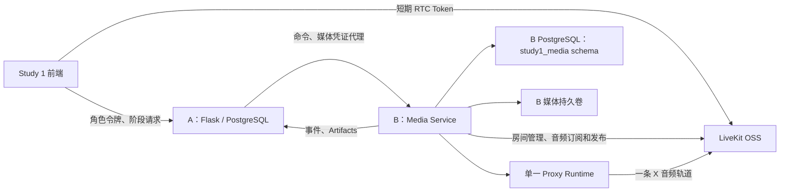

# Study 1 B 侧会议与 Proxy 服务设计

状态：已确认

日期：2026-07-26

目标仓库：`cyt2023/agent-simulation`

目标版本：Study 1 B v1

## 1. 目标

本设计为 Study 1 增加独立的 B 侧会议与 Proxy 服务，完成以下能力：

- 自托管 LiveKit OSS 纯语音会议；
- 浏览器麦克风检查、设备选择、连接与重连；
- 每个实验 Session 最多一个服务器侧 Proxy Runtime（X）；
- X 订阅 T1/T2 的语音，并向两人发布同一条语音轨道；
- 带时间戳和可靠说话人身份的 ASR；
- 版本化、可审计的 LLM 与 TTS；
- Proxy 会议和同步会议的分轨录音；
- 中性会议纪要、逐字稿、录音清单和 Agent 日志；
- 显式 handoff：X 停止主动参与后，P 接回席位；
- 面向研究者的媒体状态、显式开始/结束、事故信息与固定条件摘要重试；
- B 侧运行数据持久化、幂等、故障恢复和完整媒体导出。

A 仍然是 Session、角色、权限、实验阶段、问卷、投票、Review、研究者控制台主数据和最终导出的唯一控制者。B 不推进实验阶段，也不直接读写 A 的 PostgreSQL。

## 2. 已确认的产品决策

1. RTC 使用自托管 LiveKit OSS，开发环境通过 Docker Compose 启动；部署时允许在不改变业务接口的情况下切换到 LiveKit Cloud。
2. 所有 Study 1 会议均为纯语音，不启用摄像头或屏幕共享，参与者使用中性头像。
3. Proxy 会议由 X、T1、T2 参加；P 进入隔离等待室，不能观看或收听会议。
4. Handoff 是参与权切换，不是额外的口头汇报：X 停止主动参与并退出，P、T1、T2 随后进入同步会议。
5. 会议由研究者显式结束。B 只有收到研究者经 A 发出的结束命令后才结束当前会议并上报 `MEETING_ENDED`。
6. 实时字幕默认关闭，但服务器端 ASR 始终运行。
7. “类真人”提示词默认关闭。X 使用明确、克制、版本化的 Proxy 身份提示词。
8. Study 1 不使用旧平台的多 Agent floor bidding、私聊、交易、Proxy 自动投票或自动开始 Session。

## 3. 非目标

本版本不实现：

- 视频会议、屏幕共享或摄像头录制；
- 多 Proxy 或多 Agent 调度；
- X 作为独立被试者提交 initial/final vote；
- 私聊、交易面板或其他旧实验交互；
- B 自主开始、暂停、推进或结束 A 的实验阶段；
- B 直接查询 A 的 participant、material、submission 或 session 数据表；
- 多副本 B 服务。v1 使用单 B 实例和独立 PostgreSQL schema；横向扩展时再引入租约协调或消息队列。

## 4. 总体实验流程

```text
实验员创建 Session 并分配 P/T1/T2
→ 设备检查、知情同意、身份与角色确认
→ 三人分别阅读 Hidden Profile 私有材料
→ 三人提交讨论前个人判断与信心
→ P 配置 Proxy 并提交授权；T1/T2 等待
→ P 进入隔离等待室
→ X + T1 + T2 进行 Proxy 语音讨论
→ T1/T2 提交暂定决定及其对决定状态的理解
→ B 生成常规 AI 会议纪要和逐字稿
→ P 先报告委托预期，再阅读纪要/逐字稿
→ P 独立完成 summary 后理解测量
→ B 执行显式 handoff，X 停止主动参与
→ P + T1 + T2 进行同步语音讨论
→ 三人完成最终决策和简短后续协作任务
→ 个人问卷、关键事件回放访谈、数据导出
```

A 的 15 阶段状态机保持权威：

```text
SETUP
→ MATERIAL_READING
→ PRE_VOTE
→ PROXY_CONFIGURATION
→ PROXY_MEETING
→ TENTATIVE_DECISION
→ DELEGATION_EXPECTATION
→ REVIEW
→ COMPREHENSION_MEASUREMENT
→ HANDOFF
→ SYNC_MEETING
→ FINAL_DECISION
→ FOLLOWUP_TASK
→ POST_SURVEY
→ COMPLETED
```

## 5. 架构选择

### 5.1 采用方案：独立模块化 B 服务

在同一仓库增加独立 `media-service` 容器。B 是一个异步 Python 服务，内部按职责分模块，但 v1 作为单个部署单元运行。LiveKit 是独立 RTC 基础设施。



该方案保留 A/B 边界，同时避免 v1 立即引入消息队列和多个媒体微服务。

### 5.2 被拒绝方案

将 B 嵌入现有 Flask 后端被拒绝，因为长生命周期 RTC、录音和异步 provider 调用会与 A 的请求进程互相影响，并破坏职责边界。

立即拆分 Gateway、Proxy Worker、ASR 和 Artifact 多个服务也被拒绝，因为当前每个 Session 只有一个 X，分布式消息和部署复杂度没有相应收益。

## 6. 技术栈

- Python 3.11；
- FastAPI + Uvicorn：B 的内部 HTTP API；
- LiveKit Server OSS：RTC 房间和媒体分发；
- LiveKit Python RTC/Agents SDK：服务端订阅、X 音频发布和 room 管理；
- Vue 3 + `livekit-client`：Study 1 纯语音界面；
- SQLAlchemy + PostgreSQL：B 的幂等、运行状态和 outbox。B 使用独立 `study1_media` schema/user，其凭据不能访问 A 的 `humanagent_collab` schema；
- Pydantic：命令、事件、artifact 和内部响应校验；
- HTTPX：B → A 回调和 A → B 内部调用；
- PyAV/FFmpeg：音频解码、重采样和 FLAC 写入；
- OpenAI/Azure OpenAI/Anthropic/Mock：按 provider 能力接入；
- pytest：B 单元、契约和 LiveKit 集成测试；
- Playwright：浏览器假媒体端到端测试。

## 7. 服务边界与内部接口

### 7.1 A → B 命令

B 保留契约中的统一命令入口：

```http
POST /internal/commands
Authorization: Bearer {A_TO_B_SERVICE_TOKEN}
Content-Type: application/json
```

所有命令使用统一 envelope：

```json
{
  "command_id": "uuid",
  "session_id": "uuid",
  "phase_version": 5,
  "command": "START_PROXY_MEETING",
  "issued_at": "2026-07-26T10:00:00Z",
  "payload": {}
}
```

v1 支持以下命令：

- `START_PROXY_MEETING`；
- `END_CURRENT_MEETING`；
- `BEGIN_HANDOFF`；
- `START_SYNC_MEETING`；
- `REGENERATE_SUMMARY`；
- `STOP_SESSION`。

其中 `END_CURRENT_MEETING` 和 `REGENERATE_SUMMARY` 是 v1 为闭合实际实验流程增加的接口扩展。后续 A/B 契约对齐时保留语义，允许调整名称和 envelope 细节。

命令接受响应：

```json
{
  "accepted": true,
  "duplicate": false,
  "command_id": "uuid",
  "runtime_state": "PREPARING"
}
```

B 在返回 accepted 前必须完成 command 持久化。相同 `command_id` 返回第一次的结果。对于新的 `command_id`，B 还使用 command-specific semantic key 防止重复副作用：生命周期命令使用 `(session_id, phase_version, command)`；摘要重试使用 `(session_id, source_transcript_checksum, source_summary_version)`，因此同一来源的重复点击只生成一个目标版本，而后续针对新版本的重试仍然有效。

### 7.2 Proxy 授权上下文

`START_PROXY_MEETING.payload` 由 A 在服务器端构建，不接受研究者浏览器直接提供的材料内容：

```json
{
  "authorized_context": {
    "authorization_submission_id": "uuid",
    "proxy_config_submission_id": "uuid",
    "materials": [
      {
        "material_id": "uuid",
        "title": "Authorized material",
        "content": "Text explicitly authorized by P",
        "checksum": "sha256"
      }
    ],
    "stance": {
      "content": "Position explicitly authorized by P",
      "source_submission_id": "uuid"
    },
    "priorities": ["accuracy"]
  },
  "runtime_config": {
    "config_version": "proxy-runtime-v1",
    "prompt_version": "proxy-prompt-v1",
    "summary_prompt_version": "neutral-summary-v1",
    "language": "en",
    "live_captions": false
  }
}
```

B 不提供回查 A 数据库的代码路径。缺失字段只会减少 X 可用上下文，不会触发 B 越权获取其他角色材料。

### 7.3 A 代理媒体访问

Participant 浏览器只调用 A：

```http
POST /api/study1/sessions/{session_id}/media-access
Authorization: Bearer {participant_token}
```

A 从已验证 token 取得 `session_id`、`participant_id` 和 `role`，再调用 B：

```http
POST /internal/media-access
Authorization: Bearer {A_TO_B_SERVICE_TOKEN}
Content-Type: application/json
```

```json
{
  "session_id": "uuid",
  "phase": "PROXY_MEETING",
  "phase_version": 5,
  "participant_id": "uuid",
  "role": "teammate_1",
  "purpose": "meeting"
}
```

B 返回短期凭证：

```json
{
  "livekit_url": "ws://localhost:7880",
  "room_name": "study1-uuid-proxy-v5",
  "token": "short-lived-livekit-jwt",
  "expires_at": "2026-07-26T10:10:00Z",
  "publish_sources": ["microphone"],
  "live_captions": false
}
```

浏览器永远不能在 body/query 中选择其他角色。A 的服务器身份和 B 的访问矩阵共同执行授权。

### 7.4 研究者媒体状态和导出

B 为 A 提供以下内部只读接口：

```text
GET /internal/sessions/{session_id}/status
GET /internal/sessions/{session_id}/export
GET /internal/sessions/{session_id}/media/{artifact_path}
GET /health/live
GET /health/ready
```

`media/{artifact_path}` 只接受 A 的服务鉴权，校验路径必须位于对应 Session 的媒体根目录，并支持 HTTP Range。A 使用该接口为获准的关键事件回放页面代理时间片段音频；Participant/Researcher 浏览器不直接获得 B 存储 URI。

研究者浏览器仍然只调用 A。A 将 B 的健康状态并入 researcher DTO，并在最终 ZIP 导出时把 B 的 session media bundle 放入 `media/` 子目录。

### 7.5 B → A 事件和 artifact

B 使用现有 `X-Study1-Internal-Key` 调用：

```text
POST /api/internal/study1/media-events
POST /api/internal/study1/sessions/{session_id}/artifacts
```

每个事件使用持久化 UUID `event_id`，并复制触发 runtime 的 `phase_version`。A 的 2xx 响应才会把 outbox 项标记为 delivered。

## 8. B 内部模块

### 8.1 Command API

职责：

- 鉴权和 Pydantic schema 校验；
- 持久化命令和首次接受结果；
- 检查幂等键、语义唯一键和命令先后关系；
- 将新命令投递给 Session Orchestrator；
- 快速返回，不在 HTTP 请求中执行录音或 provider 调用。

### 8.2 Media Access Broker

职责：

- 仅接受 A 的服务器鉴权；
- 根据 session、phase version、role、purpose 和 runtime 状态执行访问矩阵；
- 创建 5 分钟有效的 LiveKit token；
- token 只允许连接指定房间、订阅音频和发布 microphone；
- 禁止 camera、screen share、data message 和房间管理权限；
- 记录 token issuance 审计信息，但不保存原始 JWT。

### 8.3 Session Orchestrator

B 的 runtime 状态只描述媒体执行，不表示或推进 A 的实验阶段：

```text
RECEIVED → PREPARING → READY → RUNNING → STOPPING → ENDED
                         ↘ FAILED
```

Handoff 使用：

```text
PREPARING_HANDOFF
→ PROXY_STOPPED
→ SYNC_ROOM_READY
→ WAITING_FOR_HUMANS
→ HANDOFF_COMPLETE
```

Orchestrator 为每个 Session 持有唯一活动 runtime lease。数据库唯一约束防止两个进程同时创建 X。

### 8.4 LiveKit Room Manager

职责：

- 创建和关闭 phase-versioned 房间；
- 管理 participant permissions；
- 处理 join、leave、reconnect、track published/unpublished；
- 强制移除角色不匹配或携带过期 phase token 的连接；
- 为研究者状态接口提供实际房间成员和轨道状态；
- 在 B 重启后与 LiveKit 的实际房间状态进行 reconciliation。

### 8.5 Proxy Runtime

每个 Session 最多一个 X。其流水线为：

```text
T1/T2 microphone tracks
→ per-track VAD
→ utterance audio
→ ASR
→ speaker-tagged turn queue
→ Proxy LLM
→ TTS PCM stream
→ one X LiveKit audio track
→ T1 and T2 subscribers
```

X 发布一条房间音频轨道，LiveKit 将同一轨道分发给 T1/T2。B 不为两人分别生成回复。

相近的重叠发言按各自 track 保留，并在 400ms 聚合窗口内作为带说话人标签的同一 LLM 输入批次。X 同时只执行一个回复。人类在 X 发言时开始说话会触发 barge-in：当前 TTS 轨道停止，记录 interruption event，然后把新 utterance 放入队列。

X 的模型输出采用结构化结果：

```json
{
  "speak": true,
  "text": "Response grounded in authorized context and the shared conversation"
}
```

`speak: false` 表示当前轮次保持沉默。这是单 Proxy 的回合策略，不是多 Agent floor bidding。

### 8.6 Provider Ports

B 定义异步 provider 接口：

- `SpeechToTextProvider.transcribe_utterance(...)`；
- `LanguageModelProvider.generate(...)`；
- `TextToSpeechProvider.synthesize(...)`。

LLM adapter 支持 `azure`、`openai`、`claude` 和 `mock`。STT/TTS adapter 支持 `azure`、`openai` 和 `mock`。配置沿用仓库已有环境变量命名，并增加 B 专用 provider/model/version 字段，避免导入旧 `AgentRunner` 的投票、行动和 floor 逻辑。

实验 Session 启动后 provider、model、voice、temperature 和 prompt version 冻结。运行中不进行未配置的跨 provider 自动降级。

### 8.7 Recorder 与 Transcript Builder

Recorder 订阅每个允许参与者的单独 LiveKit 音频 track。录音保存为 48kHz 单声道 FLAC；ASR 使用独立的 16kHz 单声道重采样流。

说话人身份来自 LiveKit track owner identity，不依赖后处理 diarization。每个 transcript segment 至少包含：

```json
{
  "segment_id": "segment-000001",
  "speaker_role": "teammate_1",
  "speaker_participant_id": "uuid",
  "start_ms": 1240,
  "end_ms": 4100,
  "text": "...",
  "confidence": 0.94,
  "language": "en",
  "track_id": "livekit-track-sid",
  "provider": "azure",
  "provider_model": "whisper-deployment",
  "final": true
}
```

若 provider 不返回 confidence，字段为 `null`，不能伪造分数。`start_ms` 和 `end_ms` 基于 B 的单调 room audio clock。Segment 同时可通过 `track_id`、录音文件和毫秒 offset 定位到可回放音频，供 A 的关键事件回放访谈使用。

### 8.8 Neutral Summary Generator

Summary Generator 只接受冻结的 Proxy meeting transcript version，不接受 participant vote、delegation expectation 或 comprehension response，以免摘要被结果变量污染。

模型首先生成带证据引用的结构化内容：

```json
{
  "topics": [],
  "evidence_raised": [],
  "agreements": [],
  "disagreements": [],
  "tentative_state": [],
  "unresolved_questions": []
}
```

每个非空条目必须带一个或多个有效 `source_segment_ids`。验证器拒绝不存在的 segment 引用、推荐性字段和空来源断言。通过验证后再渲染为 P 看到的普通文本。

摘要提示词明确禁止：

- 推荐 P 的最终选项；
- 添加逐字稿中未出现的事实；
- 推断参与者人格、能力、意图或动机；
- 使用说服性语言放大任一立场；
- 隐藏明确分歧或不确定性；
- 根据 P 后续填写的委托预期或理解测量修改摘要。

`REGENERATE_SUMMARY` 必须携带研究者原因、source transcript version、source transcript checksum 和 source summary version。B 使用原 transcript checksum、相同 prompt、model、temperature 和生成参数，创建 `source summary version + 1`，不覆盖旧版本。

### 8.9 A Client 与 Outbox

所有 B → A 事件和 artifact 先写入 outbox，再异步发送。Outbox 使用指数退避和带抖动重试。A 返回：

- `2xx`：标记 delivered；
- `409 STALE_MEDIA_EVENT`：标记 dead-letter，停止重试，不尝试修改 A phase；
- `4xx` schema/auth 错误：标记 blocked 并产生本地 incident；
- `5xx` 或网络错误：保留 pending 并重试。

## 9. 房间与权限模型

### 9.1 房间命名

```text
study1-{session_id}-device-{participant_id}
study1-{session_id}-proxy-v{phase_version}
study1-{session_id}-sync-v{phase_version}
```

Device room 为每个 participant 单独创建，不能听到其他设备检查。Proxy 和 Sync 使用不同房间，避免依赖客户端静音实现 P 隔离。

### 9.2 访问矩阵

| Purpose / Room | P | T1 | T2 | X |
| --- | --- | --- | --- | --- |
| SETUP device check | 自己的私有 room | 自己的私有 room | 自己的私有 room | 禁止 |
| PROXY_MEETING | 禁止 | 允许 | 允许 | 允许 |
| HANDOFF sync preconnect | 允许，服务端强制静音 | 允许，服务端强制静音 | 允许，服务端强制静音 | 禁止 |
| SYNC_MEETING | 允许 | 允许 | 允许 | 禁止 |

P 在 `PROXY_MEETING` 请求 media access 时，A 应拒绝；即使 A 误发请求，B 也必须拒绝。旧 token 绑定旧房间和过期 phase version，不能进入新房间。会议较长或发生重连时，浏览器必须经 A 请求新的短期 token，不能由前端自行续签。

## 10. 详细运行时序

### 10.1 设备检查

1. A 完成知情同意和角色确认。
2. Participant 页面请求自己的 device-check media access。
3. 浏览器请求麦克风权限，枚举输入设备并显示音量电平。
4. 浏览器录制并本地回放短样本，完成扬声器检查。
5. 浏览器连接自己的 LiveKit device room 并发布测试 microphone track；B 确认服务器实际收到 track，浏览器不依赖对自身 track 的订阅。
6. `Study1VoiceRoom` 将结构化检查结果交给 A 页面；由 A 保存结果和控制是否允许后续阶段。

B 不接收知情同意文本，也不决定同意是否有效。

### 10.2 Proxy meeting

1. Researcher 将 A 推进到 `PROXY_MEETING`。
2. A 服务端构建授权上下文并发送 `START_PROXY_MEETING`。
3. B 持久化命令、创建 Proxy room、Recorder 和唯一 X Runtime。
4. X 加入房间并成功发布单一 audio track 后，B 发出 `MEDIA_READY`。
5. T1/T2 经 A 获取 token 并连接；B 发出 `PARTICIPANT_JOINED`。
6. P 页面只显示隔离等待室，不请求 token，不渲染 audio 元素。
7. B 持续分轨录音、ASR、构建 transcript，并运行 X 的 LLM/TTS 回路。
8. Researcher 点击“结束当前会议”，A 发送 `END_CURRENT_MEETING`。
9. B 关闭新 utterance 输入；当前 TTS 最多获得 5 秒收尾时间，超时则切断并记录 `truncated_output`。
10. B flush 音频、segment、provider log 和 manifest，然后发出 `MEETING_ENDED`。
11. A 可推进到 `TENTATIVE_DECISION`；B 在后台生成 transcript 和 neutral summary artifact。
12. A 仍要求 P 先提交 `delegation_expectation`，并等待 summary ready 后才允许进入 Review。

### 10.3 Review 前 artifact

B 向 A 发送：

- `transcript`：面向 UI 的逐行文本；
- `summary`：面向 P 的中性普通文本；
- `recording_manifest`：B session bundle 中录音文件的 URI 和 checksum；
- `agent_log_manifest`：provider 调用、prompt/config version 和 Agent turn 日志 URI。

逐行 transcript 与当前 Review UI 兼容：

```text
[00:01.240-00:04.100] T1: ...
[00:05.020-00:08.650] X: ...
[00:09.100-00:12.400] T2: ...
```

结构化 segment 放在 transcript metadata 和 B 导出文件中。

### 10.4 Handoff

1. P 完成 Review 和 comprehension measurement。
2. Researcher 将 A 推进到 `HANDOFF` 并发送 `BEGIN_HANDOFF`。
3. B 停止 X 的 turn queue、LLM、TTS 和 published track，强制移除 X。
4. B 关闭 Proxy room，创建 Sync room 和同步会议 Recorder。
5. P/T1/T2 经 A 获取 handoff preconnect token并连接；B 对这一阶段的所有 microphone track 执行服务端强制静音，并立即重新静音提前发声或重复发布的 track。
6. B 确认 X 不在任何活动 room，且 P/T1/T2 均已连接并发布可用 microphone track。
7. B 发出 `HANDOFF_COMPLETE`。
8. 在任何一个前置条件缺失时，B 不发完成事件，而是通过 status/`MEDIA_ERROR` 说明原因。

### 10.5 Sync meeting

1. Researcher 将 A 推进到 `SYNC_MEETING` 并发送 `START_SYNC_MEETING`。
2. B 保留现有 P/T1/T2 连接，允许解除静音并开始录音和 ASR。
3. X 不存在于 Sync room，且不会调用 Proxy LLM/TTS。
4. Researcher 显式发送 `END_CURRENT_MEETING`。
5. B flush 同步会议录音、transcript 和 manifest，并发出 `MEETING_ENDED`。
6. A 决定何时进入 `FINAL_DECISION`。

### 10.6 Stop session

`STOP_SESSION` 幂等执行：

- 拒绝新的 media access；
- 停止 X、录音、ASR、provider task 和 outbox 以外的 session task；
- flush 可恢复的 artifact；
- 移除 participant 并关闭 LiveKit rooms；
- 将 B runtime 标为 `STOPPED`；
- 不改变 A phase。

## 11. Proxy 行为与隐私约束

X 的系统提示词必须：

- 明确其身份是代表 P 的 Proxy X；
- 只使用 A 提供的 P 授权材料、授权立场和会议中已经共享的内容；
- 不声称知道 T1/T2 未说出的私有材料；
- 不代表 P 提交实验投票、置信度或问卷；
- 不虚构 P 的偏好、经历或授权；
- 不操纵参与者或给出元实验指导；
- 不执行文本私聊、交易或其他工具动作；
- 输出适合语音的简短自然语言，不假装是真人。

Provider 输入、输出和 prompt snapshot 写入受保护的 Agent log。普通应用日志只记录 request id、延迟、token/audio duration、provider version 和错误码，不写完整私有 prompt。

## 12. Participant UI

新增 `Study1VoiceRoom`，与旧 `frontend/src/components/MeetingRoom.vue` 完全隔离。它包括：

- 麦克风权限状态；
- 输入设备选择；
- 输入音量 meter；
- 扬声器测试；
- 静音控制；
- LiveKit connecting/connected/reconnecting/failed 状态；
- P、T1、T2、X 的中性头像；
- speaking indicator；
- 默认关闭、通过 session config 开启的字幕区域。

它不包括：

- 摄像头和屏幕共享；
- 私聊或文本输入；
- 交易、投票或任务提交；
- floor bidding；
- 暴露 room name、token 或内部 participant metadata 的调试 UI。

阶段呈现：

- `PROXY_MEETING`：P 继续使用 WaitingRoom；T1/T2 使用 Study1VoiceRoom；
- `HANDOFF`：三人看到明确的 X 停止、P 接回席位和连接检查状态；
- `SYNC_MEETING`：P/T1/T2 使用 Study1VoiceRoom，界面中不存在 X tile；
- 非媒体阶段不创建 LiveKit connection。

## 13. Researcher UI

Researcher 控制台增加媒体状态区：

- B service、LiveKit、room、Recorder、ASR、LLM、TTS、X Runtime 状态；
- P/T1/T2 的 joined、microphone published、muted、reconnecting、disconnected 状态；
- 当前 room kind、started_at、elapsed time 和 recording gap；
- transcript/summary/recording/agent log artifact 状态和版本；
- start meeting、end current meeting、stop session；
- fixed-condition regenerate summary，必须填写原因；
- media error 和 incident identifiers。

人工 override 仍由 A 执行并记录原因。B 的状态不能直接触发 A phase transition。

## 14. B 数据模型

B 使用 PostgreSQL 中独立的 `study1_media` schema 和专用数据库用户，至少包含以下表。它可以与 A 共用 PostgreSQL cluster，但 B 的凭据不得访问 `humanagent_collab`：

### `commands`

- `command_id` 主键；
- `session_id`、`phase_version`、`command`；
- 原始 envelope JSON；
- accepted response JSON；
- `received_at`、`status`、`error_code`；
- command-specific `semantic_key` 唯一约束；

### `media_sessions`

- `runtime_id` 主键；
- `session_id`、`phase_version`、`room_kind`、`room_name`；
- `state`、`started_at`、`ended_at`；
- frozen runtime config JSON；
- active lease owner 和 lease expiry；
- recording root URI。

### `participant_connections`

- `runtime_id`、`participant_id`、`role`；
- LiveKit participant/track SID；
- joined/left/reconnected timestamps；
- microphone published/muted 状态；
- disconnect reason。

### `transcript_segments`

- segment schema 中的全部字段；
- ASR request id；
- source audio checksum 和 byte/time offsets；
- created/finalized timestamps。

### `provider_calls`

- request id、runtime id、turn id；
- provider、model/deployment、config/prompt version；
- started/ended timestamps、latency、usage；
- outcome、retry count、error code；
- 受保护输入输出文件引用。

### `artifacts`

- artifact id、session id、type、version；
- content/storage URI、checksum；
- generator version、metadata；
- created/published timestamps。

### `outbox`

- outbox id、kind、destination、payload；
- attempt count、next attempt、last status/error；
- pending/delivered/dead-letter/blocked 状态。

### `incidents`

- incident id、session/runtime/component；
- severity、error code、safe detail；
- occurred/resolved timestamps；
- related command/event/provider request ids。

## 15. 媒体和 Artifact 存储

```text
media-data/{session_id}/{phase_version}/
├── audio/
│   ├── principal.flac
│   ├── teammate_1.flac
│   ├── teammate_2.flac
│   └── proxy.flac
├── transcript.json
├── transcript.txt
├── summary-v1.json
├── summary-v1.txt
├── agent-log.jsonl
├── provider-config.json
└── recording-manifest.json
```

不适用于该 room 的角色文件不创建。例如 Proxy room 不创建 `principal.flac`，Sync room 不创建 `proxy.flac`。

文件先写临时名，flush、fsync 和 checksum 完成后原子 rename。Manifest 记录：

- 文件相对 URI、MIME type、byte size、SHA-256；
- track SID、participant role、采样率、声道、开始和结束时间；
- recording gaps 和原因；
- B build、LiveKit、provider、prompt/config version；
- source command id 和 phase version。

A 的最终 ZIP 继续包含原有 A 文件，并增加：

```text
media/
├── proxy-meeting/
├── sync-meeting/
├── media-events.jsonl
├── incidents.jsonl
└── media-schema-version.json
```

关键事件回放由 A 决定受访者、可见片段和测量流程。B 只提供经过 A 鉴权的 Range 音频流，以及 segment 到录音 offset 的稳定映射，不自行选择“关键”事件。

## 16. 故障处理与恢复

### 16.1 B 重启

启动时 B 查询所有非终态 runtime，并与 LiveKit 当前 room/participant/track 对账：

- room 存在且录音可恢复：重新取得 lease，恢复 Recorder 和 X；
- X 已断开：从授权上下文、冻结配置和已确认 transcript 重建对话上下文后重新加入；
- room 不存在：将 runtime 标为 failed，写 incident 并向 A 排队 `MEDIA_ERROR`；
- 已结束但 artifact 未发布：继续完成文件校验和 outbox 发布。

### 16.2 Participant 断线

浏览器使用 LiveKit 自动重连。短暂重连只更新状态；超过配置超时后 B 发出 `PARTICIPANT_LEFT`。重连后发出新的 join/reconnect payload，但不创建第二条 participant identity。

### 16.3 Provider 故障

- ASR 失败：保留源音频，按相同 provider/config 重试；仍失败时标记 transcript gap 并发 `MEDIA_ERROR`。
- LLM 失败：相同 request id 最多重试配置次数；不伪造 X 回复。
- TTS 失败：不播放浏览器本地替代语音，不跨 provider 降级；停止该 turn 并发 `MEDIA_ERROR`。
- Summary 验证失败：使用相同 frozen config 重试；耗尽次数后不发布 summary ready，并报告明确错误。

### 16.4 A 不可用

已经开始的媒体会话继续本地录音，B 将事件和 artifact 留在 outbox。A 恢复后按原 `event_id`/`artifact_id` 重发。研究者无法通过 A 下发控制时，不允许 B 自主推进阶段。

### 16.5 结束会议

收到 `END_CURRENT_MEETING` 后：

- 立即停止接收新 turn；
- 当前 TTS 最多 5 秒收尾；
- flush recorder 和 transcript；
- 记录缺失轨道或未完成 segment；
- 只有完成最小可恢复落盘后才排队 `MEETING_ENDED`。

## 17. 安全与隐私

- A → B 使用独立 service token；B → A 使用 `STUDY1_INTERNAL_API_KEY`；
- production 使用 HTTPS/WSS，LiveKit API secret、service token 和 provider keys 不进入镜像或 Git；
- participant LiveKit JWT 有效期 5 分钟并绑定单一 room 和 participant identity；
- token grant 禁止摄像头、屏幕、data message 和 room admin；
- participant display name 使用角色或研究编号，不使用真实姓名；
- B 日志采用 allowlist 字段，不记录 Authorization header、JWT、API key 或完整私有材料；
- 媒体 volume 只挂载到 B，B 的 PostgreSQL 凭据只允许访问 `study1_media`；A 通过内部 export 接口读取 bundle；
- 回放音频必须由 A 逐次鉴权代理，B 拒绝目录遍历、跨 Session path 和未带 Range 上限的大文件读取；
- Summary 不能读取 P 的 delegation expectation 或 comprehension response；
- P 的隔离由房间级授权执行，不依赖 CSS、静音或隐藏播放器。

## 18. 可观测性

B 记录结构化日志和指标：

- command 接受、重复、冲突和执行时长；
- active rooms、active X runtimes、participant connections；
- microphone track、recording bytes、recording gaps；
- utterance 数量、ASR/LLM/TTS latency 和错误率；
- speech end 到首个 X audio frame 的端到端 latency；
- outbox pending、retry、dead-letter；
- artifact generation latency 和 checksum failures；
- handoff 各前置条件耗时。

日志关联字段统一使用 `session_id`、`phase_version`、`runtime_id`、`command_id`、`turn_id`、`request_id`，不使用自由文本材料作为关联字段。

## 19. 测试策略

### 19.1 B 单元测试

覆盖：

- command envelope 校验和跨重启幂等；
- 语义唯一键阻止重复 X；
- access matrix 的每个允许/拒绝组合；
- LiveKit token grant 不含视频/管理权限；
- runtime 状态转换和非法顺序；
- overlap ordering、barge-in 和单回复约束；
- transcript monotonic timestamps 和 speaker mapping；
- neutral summary evidence references 和禁止字段；
- fixed-condition summary version increment；
- outbox 2xx/409/4xx/5xx 处理；
- stop/restart reconciliation。

### 19.2 A/B 契约测试

使用 Mock A 验证：

- B 接受 A command 并保留 `phase_version`；
- B 生成现有 A 可接受的 event/artifact envelope；
- duplicate callback 不产生第二次副作用；
- stale event 停止重试；
- transcript plain text 与现有 Review UI 兼容；
- A 的 HttpMediaGateway 未配置时继续使用 Mock。

### 19.3 LiveKit 集成测试

Docker 启动真实 LiveKit：

- T1/T2/X 成功加入 Proxy room；
- P token 请求被拒绝且无法连接；
- X 只发布一条 audio track，T1/T2 订阅相同 track SID；
- 假音频触发 ASR mock、LLM mock 和 TTS mock；
- 分轨录音和 transcript 对齐；
- duplicate start 不创建第二个 X；
- handoff 强制移除 X；
- Sync room 只有 P/T1/T2；
- B restart 后恢复或明确 fail；
- `END_CURRENT_MEETING` flush 后才上报结束。

### 19.4 浏览器端到端测试

Playwright 使用 Chromium fake media flags：

- device check 成功和麦克风拒绝场景；
- T1/T2 在 Proxy phase 看到语音界面；
- P 只看到隔离等待室且页面没有 LiveKit connection；
- mute、device switch、reconnect 状态不破坏布局；
- handoff 状态清楚显示 X 停止和 P 加入；
- Sync phase 不显示 X；
- captions 默认不可见；
- 纯语音页面不请求 camera permission。

### 19.5 回归测试

每次变更运行：

```powershell
$env:PYTHONPATH=(Resolve-Path 'backend').Path
python -m pytest -p no:cacheprovider backend\tests\study1 -q
python -m pytest -p no:cacheprovider media-service\tests -q
cd frontend
yarn build
```

旧实验路由和组件继续存在，但 Study 1 不引用旧 MeetingRoom、floor service 或 AgentRunner。

## 20. 验收标准

功能验收必须同时满足：

1. P 无法获得 Proxy room token、加入房间或订阅 Proxy 音频。
2. 每个 Session 同时最多存在一个 X Runtime。
3. T1/T2 收到同一条 X published audio track。
4. X 只使用 P 授权材料、授权立场和会议共享内容。
5. X 不提交 initial/final vote，不访问私聊、交易或旧 Agent action。
6. Transcript 说话人正确、时间单调，并可追溯到对应音轨和 provider request。
7. Neutral summary 的每条事实内容可追溯到有效 transcript segment。
8. P 提交 delegation expectation 前，A 不开放 Review；B 不读取该 expectation 生成摘要。
9. `HANDOFF_COMPLETE` 只在 X 已退出且 P/T1/T2 media ready 后发出。
10. Sync room 不存在 X，且不产生 Proxy LLM/TTS 调用。
11. 重复命令、B 重启和 A callback 暂时失败不会重复开始或结束会议。
12. 会议结束后 60 秒内生成 transcript 和 summary，或产生明确、可审计的 `MEDIA_ERROR`。
13. speech end 到首个 X TTS audio frame 的目标为 P95 小于 5 秒。
14. 最终 ZIP 包含 A 数据和完整 media bundle、录音、逐字稿、摘要、Agent 日志及配置版本。
15. A Study 1 回归测试、B 测试、LiveKit 集成测试和前端构建全部通过。
16. A 能用 transcript segment 的时间范围代理回放对应音频，且不能读取其他 Session 的媒体路径。

## 21. 实施边界

本设计要求为闭合 v1 进行少量 A 集成修改：

- 增加可配置 `HttpMediaGateway`，默认仍保留 Mock；
- A 服务端构建并发送 P 授权上下文；
- 增加 participant media-access 代理；
- 增加 researcher media-status 和 B export 代理；
- 增加由 A 鉴权的关键事件 Range 音频代理；
- 增加 `END_CURRENT_MEETING` 和 `REGENERATE_SUMMARY` 的 researcher 操作；
- 将 B media bundle 合并进最终 ZIP；
- 在 Study 1 participant view 中挂载新的纯语音组件。

这些修改不改变 A 的状态机所有权，不允许 B 写 A 主数据库，也不允许 participant/researcher 浏览器直接调用 B 的内部控制 API。
